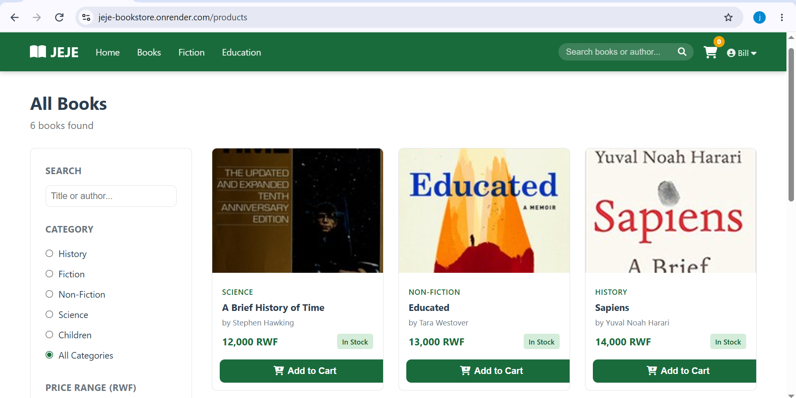
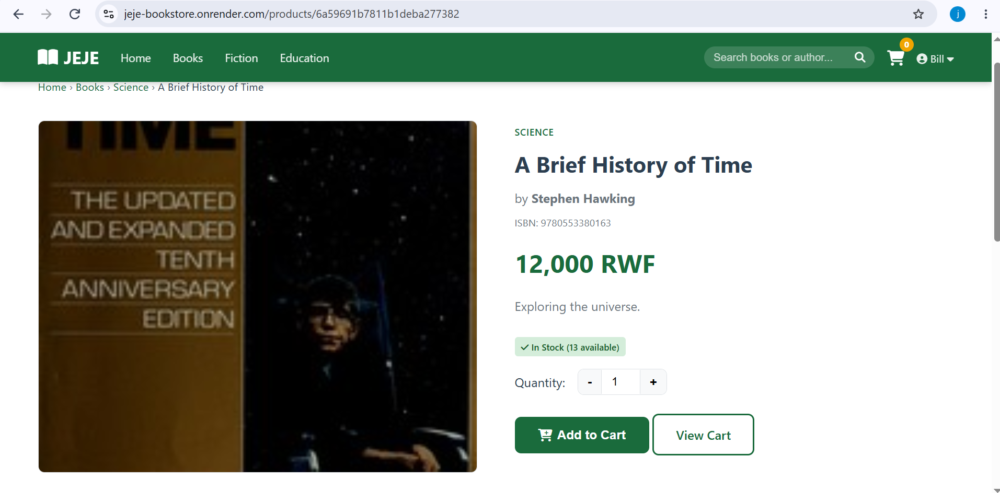
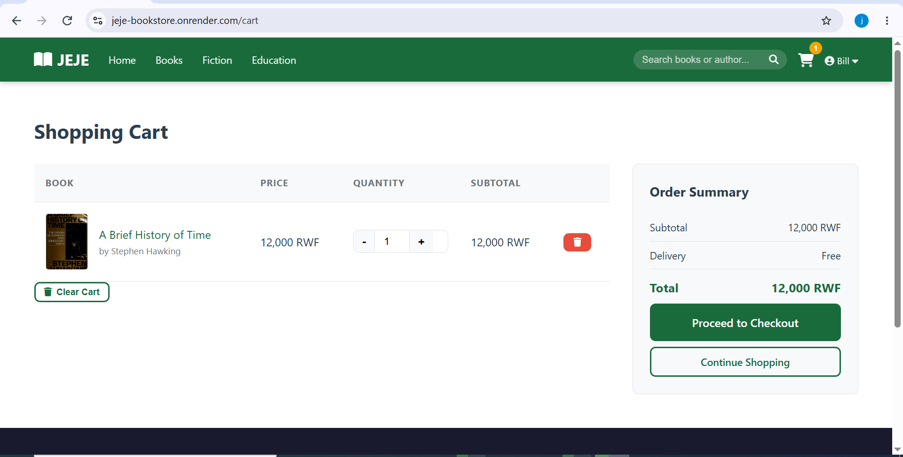
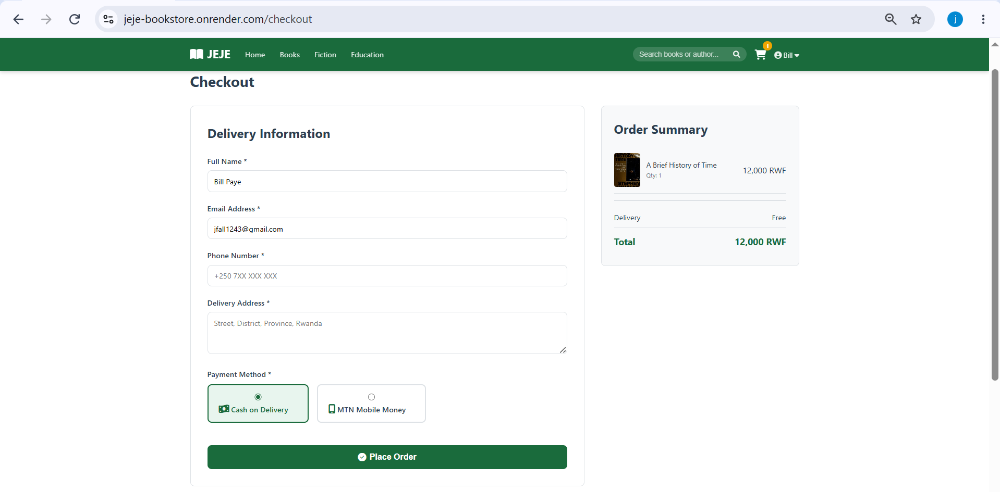
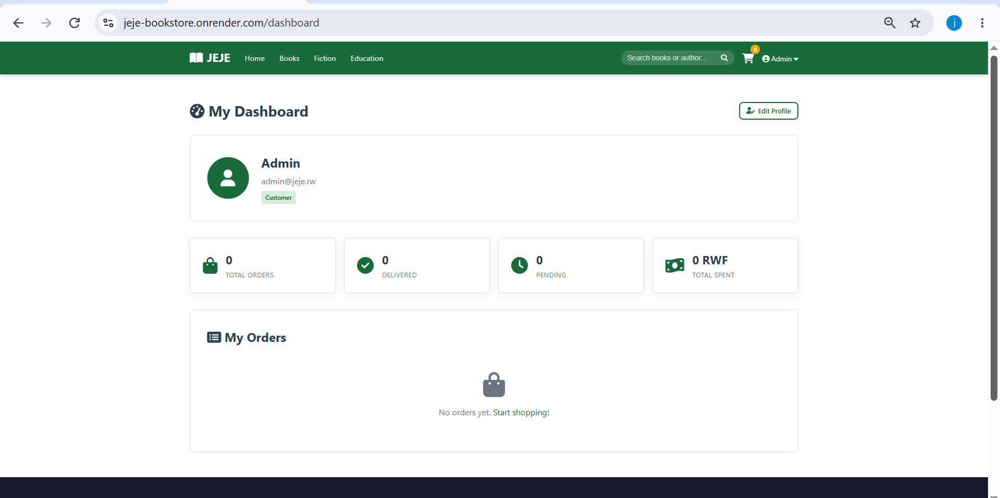
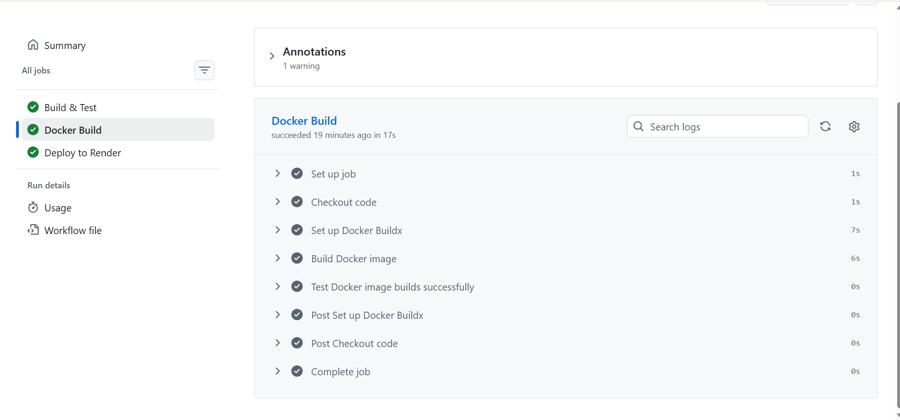
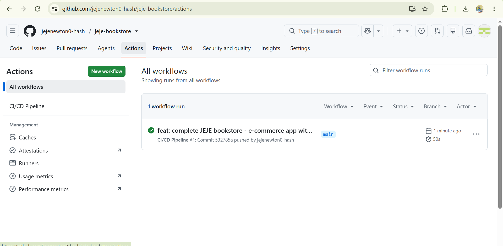

# 📚 JEJE — E-Commerce Web Application

> **EWA408510 – E-Commerce and Web Application | Final Examination Project**  
> Academic Year 2025–2026

A full-stack e-commerce web application for an online bookstore based in Rwanda. Built with Node.js, Express, NeDB (dev) and MongoDB Atlas (prod), deployed with Docker and automated via GitHub Actions CI/CD.

---

## 🌐 Live Demo

**Deployment URL:** `https://jeje-bookstore.onrender.com`

---

## 👤 Author

| Field | Value |
|-------|-------|
| Student | Jeje Charles Newton |
| Course | EWA408510 – E-Commerce and Web Application |
| Instructor | Eric Maniraguha |
| Academic Year | 2025–2026 |

---

## 🚀 Features

- **Responsive UI** — Mobile-friendly design with consistent branding
- **Product Catalog** — Browse 12+ books across 5 categories
- **Search & Filter** — Filter by category, author, title, and price range
- **Pagination** — Products page with 9 books per page
- **Shopping Cart** — Add, remove, update quantities, auto-calculated totals
- **Checkout** — Form validation, order summary, confirmation page
- **Payment** — Cash on Delivery + MTN Mobile Money (simulated)
- **User Auth** — Register, login, logout with bcrypt password hashing
- **Admin Dashboard** — Manage products (CRUD) and orders
- **Analytics View** — Admin analytics page
- **User Dashboard** — Customers can view their order history
- **Database** — NeDB (dev, embedded) + MongoDB Atlas (production)
- **Docker** — Containerized with Dockerfile and docker-compose
- **CI/CD** — GitHub Actions: build → test → Docker build → deploy

---

## 🛠️ Tech Stack

| Layer | Technology |
|-------|-----------|
| Runtime | Node.js 20 |
| Framework | Express.js 4.18 |
| Database (dev) | NeDB (embedded file-based) |
| Database (prod) | MongoDB Atlas |
| ORM (prod) | Mongoose |
| Templating | EJS |
| Auth | bcryptjs + express-session |
| Validation | express-validator |
| Testing | Jest + Supertest |
| Container | Docker + docker-compose |
| CI/CD | GitHub Actions |
| Deployment | Render.com |

---

## 📁 Project Structure

```
ecommerce-app/
├── server.js                    # Express app entry point
├── package.json
├── Dockerfile
├── docker-compose.yml
├── render.yaml                  # Render.com deployment config
├── REPORT.md                    # Full project report
├── .env.example                 # Environment variables template
├── .github/
│   └── workflows/
│       └── ci-cd.yml            # GitHub Actions CI/CD pipeline
├── src/
│   ├── models/
│   │   └── database.js          # NeDB + MongoDB setup & seed data
│   └── routes/
│       ├── pages.js             # Server-rendered page routes
│       ├── products.js          # Products REST API
│       ├── cart.js              # Cart REST API (session-based)
│       ├── orders.js            # Orders REST API
│       ├── auth.js              # Auth REST API
│       └── admin.js             # Admin dashboard routes
├── views/
│   ├── partials/
│   │   ├── header.ejs
│   │   └── footer.ejs
│   ├── admin/
│   │   ├── dashboard.ejs
│   │   ├── products.ejs
│   │   ├── product-edit.ejs
│   │   ├── orders.ejs
│   │   ├── analytics.ejs
│   │   └── profile.ejs
│   ├── index.ejs
│   ├── products.ejs
│   ├── product-detail.ejs
│   ├── cart.ejs
│   ├── checkout.ejs
│   ├── order-confirmation.ejs
│   ├── dashboard.ejs
│   ├── profile.ejs
│   ├── login.ejs
│   ├── register.ejs
│   └── 404.ejs
├── public/
│   ├── css/style.css
│   ├── js/main.js
│   └── images/
├── docs/
│   └── screenshots/             # Application screenshots
├── data/                        # NeDB database files (auto-created, gitignored)
└── tests/
    └── app.test.js
```

---

## ⚙️ Local Setup

### Prerequisites
- Node.js 18+ and npm
- Docker (optional)

### Run with Node.js

```bash
# Clone the repository
git clone https://github.com/jejenewton0-hash/jeje-bookstore.git
cd jeje-bookstore

# Install dependencies
npm install

# Start the server
npm start
```

Open [http://localhost:3000](http://localhost:3000)

> The `data/` directory and database files are created automatically on first run. Seed data (12 books, 5 categories, admin account) is inserted automatically.

### Environment Variables

Copy `.env.example` to `.env` and fill in values:

```bash
cp .env.example .env
```

| Variable | Description | Default |
|----------|-------------|---------|
| `PORT` | Server port | `3000` |
| `SESSION_SECRET` | Express session secret | `jeje-secret-2025` |
| `NODE_ENV` | Environment (`development`/`production`) | `development` |
| `MONGO_URI` | MongoDB Atlas URI (production only) | — |

### Run with Docker

```bash
# Build and start
docker-compose up --build

# Stop
docker-compose down
```

---

## 🧪 Running Tests

```bash
npm test
```

Tests cover: Products API, Cart API, Auth API, Orders API, and Page Routes.

```
PASS tests/app.test.js
  Products API
    ✓ GET /api/products returns array
    ✓ GET /api/products/categories returns categories
    ✓ GET /api/products with search filter works
    ✓ GET /api/products/:id with invalid id returns 404
  Cart API
    ✓ GET /api/cart returns cart object
    ✓ POST /api/cart/add with invalid productId returns 404
  Auth API
    ✓ POST /api/auth/register with invalid data returns 400
    ✓ POST /api/auth/login with wrong credentials returns 401
  Orders API
    ✓ POST /api/orders with empty cart returns 400
  Page Routes
    ✓ GET / returns homepage
    ✓ GET /products returns products page
    ✓ GET /cart returns cart page
    ✓ GET /login returns login page
```

---

## 🗄️ Database Design

### Collections

```
users        { name, email, password(hashed), role, photo, createdAt }
categories   { name, description }
products     { name, description, price, stock, image, categoryId, author, isbn, createdAt }
orders       { userId, customerName, customerEmail, customerPhone, customerAddress,
               paymentMethod, items[{ productId, name, image, quantity, price }],
               total, status, createdAt }
```

### Relationships
- `products.categoryId` → `categories._id` (Many-to-One)
- `orders.userId` → `users._id` (Many-to-One, optional for guest checkout)
- `orders.items[].productId` → `products._id` (embedded reference)

---

## 🔐 Default Admin Account

| Field | Value |
|-------|-------|
| Email | admin@jeje.rw |
| Password | admin123 |

> Admin account is auto-created on first run via database seed.

---

## 🐳 Docker

```bash
# Build image
docker build -t jeje .

# Run container
docker run -p 3000:3000 jeje

# Or use docker-compose (recommended)
docker-compose up --build
```

The `docker-compose.yml` includes:
- Port mapping `3000:3000`
- Persistent volume for NeDB data files
- Health check on `http://localhost:3000`
- Auto-restart policy

---

## 🔄 CI/CD Pipeline

The GitHub Actions workflow (`.github/workflows/ci-cd.yml`) runs on every push to `main`:

```
Push to main
     │
     ▼
┌─────────────────┐
│  Build & Test   │  npm ci → mkdir data → npm test
└────────┬────────┘
         ▼
┌─────────────────┐
│  Docker Build   │  docker build -t jeje:latest .
└────────┬────────┘
         ▼
┌─────────────────┐
│  Deploy         │  curl Render deploy hook (main only)
└─────────────────┘
```

To enable auto-deploy, add `RENDER_DEPLOY_HOOK_URL` as a GitHub repository secret.

---

## 🌍 Deployment (Render.com)

1. Push code to GitHub
2. Connect repo to [Render.com](https://render.com)
3. `render.yaml` auto-configures the service
4. Set `MONGO_URI` in Render dashboard → Environment
5. Add `RENDER_DEPLOY_HOOK_URL` as a GitHub secret for auto-deploy on push

---

## 🗺️ Application Flow

```
/ (Home)
 ├── /products (Browse + Filter + Pagination)
 │    └── /products/:id (Detail + Add to Cart)
 │         └── /cart (View & Edit Cart)
 │              └── /checkout (Place Order)
 │                   └── /order-confirmation/:id ✅
 ├── /login  ──┐
 ├── /register ┘── /dashboard (Order History)
 │                 /profile   (Edit Profile)
 └── /admin (Admin Only)
      ├── /admin/products  (CRUD)
      ├── /admin/orders    (View & Update Status)
      └── /admin/analytics (Stats)
```

---

## 📸 Screenshots

### Homepage


### Products Page


### Product Detail


### Shopping Cart


### Checkout


### Admin Dashboard


### Docker Build (CI/CD)


### CI/CD Pipeline


---

## 📄 Project Report

See [`REPORT.md`](REPORT.md) for the full project report including system architecture, database design, CI/CD implementation, Docker implementation, challenges, and future enhancements.
